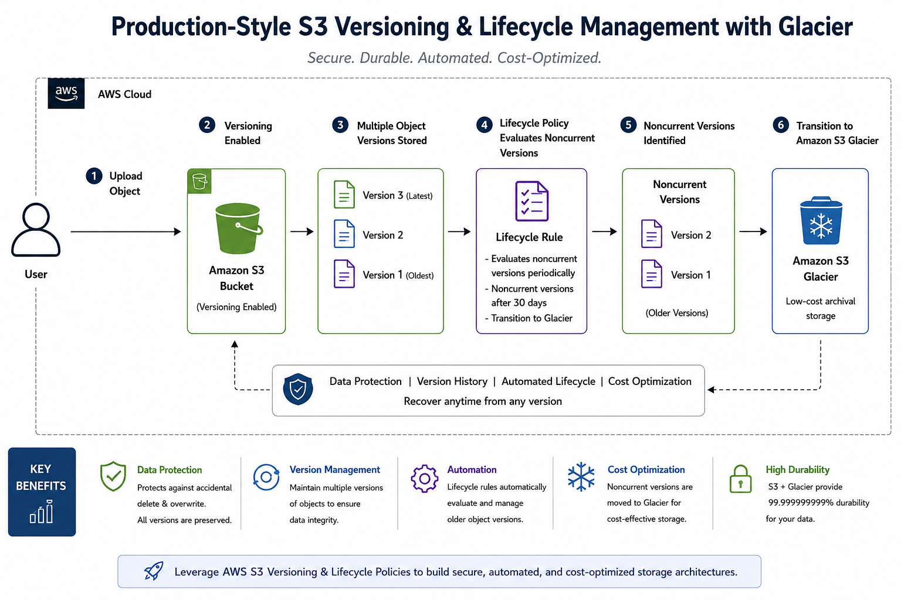

<div align="center">

# ☁️ Production-Style S3 Versioning & Lifecycle Management on AWS

### Automating Cloud Storage Optimization, Version Control & Glacier Archival using Amazon S3 Lifecycle Policies

<br>


</div>

---

# 📌 Project Overview

This project demonstrates a **production-style AWS S3 storage lifecycle architecture** implementing:

- ✅ S3 Versioning
- ✅ Lifecycle Management Policies
- ✅ Glacier Archival Workflow
- ✅ Automated Storage Optimization
- ✅ Noncurrent Version Management
- ✅ Cost Optimization Strategy

The implementation simulates how organizations automate storage lifecycle operations in real-world cloud environments using native AWS services.

---

# 🚀 Real-World Problem

Organizations storing large amounts of cloud data face major challenges:

- Accidental object deletion
- Data overwrite risks
- Increasing storage costs
- Manual archival workflows
- Long-term compliance retention requirements

Without proper lifecycle management:
- storage costs increase rapidly
- backups become difficult to manage
- recovery becomes unreliable

---

# ✅ Solution Implemented

This project implements:

### 🔹 S3 Versioning
Maintains multiple versions of objects for recovery and protection.

### 🔹 Lifecycle Policies
Automates storage management based on object age.

### 🔹 Glacier Transition
Moves older noncurrent versions to low-cost archival storage automatically.

### 🔹 Storage Cost Optimization
Reduces long-term storage expenses significantly.

---

# 🏗️ Architecture Diagram

<div align="center">



</div>

---

# ⚙️ AWS Services Used

| AWS Service | Purpose |
|---|---|
| Amazon S3 | Cloud object storage |
| S3 Versioning | Object version protection |
| Lifecycle Policies | Automated storage management |
| S3 Glacier | Long-term archival storage |

---

# 🔄 S3 Versioning Workflow

```text
User Uploads Object
          ↓
S3 Stores Current Version
          ↓
User Updates Same Object
          ↓
Previous Version Becomes Noncurrent
          ↓
Lifecycle Policy Evaluates Old Versions
          ↓
Noncurrent Version Transitions to Glacier
```

---

# 🧠 Key Cloud Concepts Covered

## ✅ S3 Versioning
Protects against:
- accidental deletion
- overwrites
- data corruption

---

## ✅ Lifecycle Policies
Automates:
- archival
- transition
- expiration workflows

---

## ✅ Glacier Storage
Provides:
- low-cost archival
- long-term retention
- backup optimization

---

## ✅ Cost Optimization
Demonstrates:
- active vs archival storage
- automated cost reduction
- storage lifecycle automation

---

# 📂 Repository Structure

```text
.
├── architecture/
├── implementation-guide/
├── screenshots/
├── video-demo/
├── documentation/
└── README.md
```

---

# 📁 Project Sections

## 🏗️ Architecture

Contains:
- production-style architecture diagram
- lifecycle workflow explanation
- storage transition design

📂 Folder:
```text
architecture/
```

---

## 🛠️ Implementation Guide

Contains:
- step-by-step AWS implementation
- S3 versioning setup
- lifecycle rule configuration
- Glacier transition workflow

📂 Folder:
```text
implementation-guide/
```

---

## 🎥 Video Demonstration

Contains:
- practical implementation walkthrough
- lifecycle management demo
- Glacier archival demonstration

📂 Folder:
```text
video-demo/
```

---

## 📄 Documentation

Contains:
- complete project documentation PDF
- production-style architecture explanation
- real-world use cases
- cloud storage concepts

📂 Folder:
```text
documentation/
```

---

# 📄 Project Documentation

👉 [View Full Documentation](./documentation/AWS_S3_Lifecycle_Management.pdf)

---

# 🎯 Enterprise Use Cases

## 🏦 Backup & Disaster Recovery
Protects critical backups using archival storage.

---

## 🏥 Compliance & Audit Logs
Stores long-term logs for regulatory compliance.

---

## 🎬 Media Asset Archival
Archives infrequently accessed media assets cost-effectively.

---

# 📈 Production Benefits

| Feature | Benefit |
|---|---|
| Versioning | Prevents accidental data loss |
| Lifecycle Policies | Eliminates manual archival |
| Glacier Storage | Reduces storage costs |
| Automation | Improves operational efficiency |
| Archival Strategy | Supports compliance retention |

---

# 🧪 Challenges Solved

✅ Understanding noncurrent object versions  
✅ Lifecycle rule evaluation workflow  
✅ Glacier transition timing  
✅ Storage cost optimization concepts  
✅ Version-controlled object management  

---

# 💡 Key Learnings

- S3 Versioning maintains object history
- Lifecycle policies automate archival workflows
- Glacier significantly reduces storage cost
- Noncurrent versions can be archived automatically
- Production storage management requires automation

---

# 🔮 Future Enhancements

- S3 Intelligent-Tiering integration
- Cross-Region Replication (CRR)
- EventBridge automation
- Lambda-based lifecycle management
- CloudWatch storage monitoring dashboard

---

# 🏁 Final Outcome

Successfully implemented a **production-style cloud storage lifecycle management architecture** using:

- Amazon S3
- S3 Versioning
- Lifecycle Policies
- Glacier Archival Storage

This project demonstrates real-world AWS cloud storage optimization and automated archival workflows used in enterprise cloud environments.

---

# 👨‍💻 Author

## Adhithyan Sivaraman T

B.Tech student passionate about:
- Cloud Computing
- AWS Architecture
- DevOps
- Infrastructure Engineering
- Project-Based Learning

This project is part of my hands-on cloud engineering learning journey where I build production-style AWS projects to understand real-world cloud architecture, disaster recovery, automation, and infrastructure design concepts.

---

# 🔗 Connect With Me

## LinkedIn
👉 www.linkedin.com/in/adhithyan-sivaraman-t-399b5b362

## GitHub
👉 https://github.com/Adhithyan-10

---

# 🚀 More AWS & Cloud Projects

I’m actively building more:
- AWS Cloud Projects
- DevOps Projects
- Infrastructure Automation Projects
- Production-Style Architecture Implementations

Feel free to explore my GitHub profile for more hands-on cloud engineering projects and learning journeys.

⭐ If you found this project useful, consider giving it a star!

<div align="center">

### Thanks for visiting this repository 🚀

</div>
