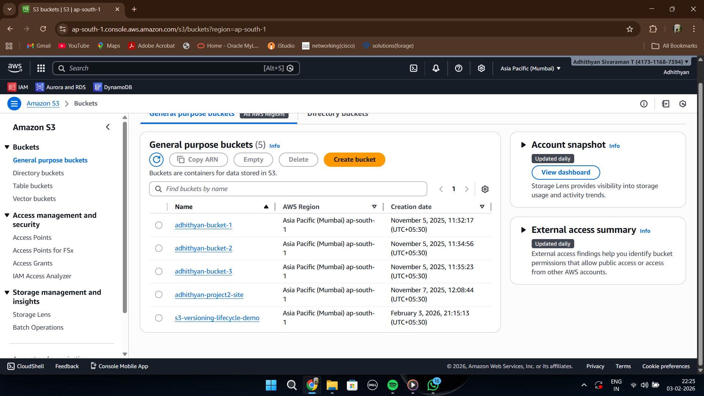
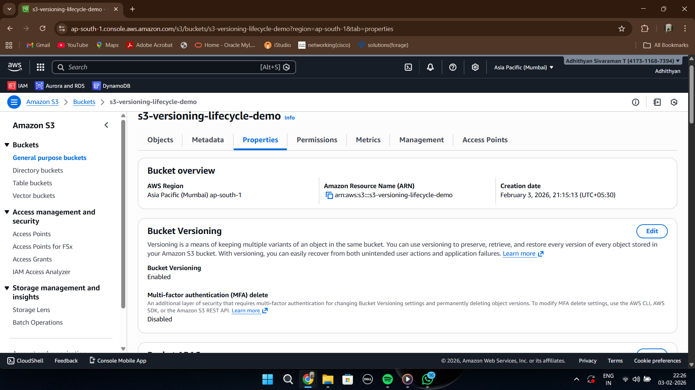
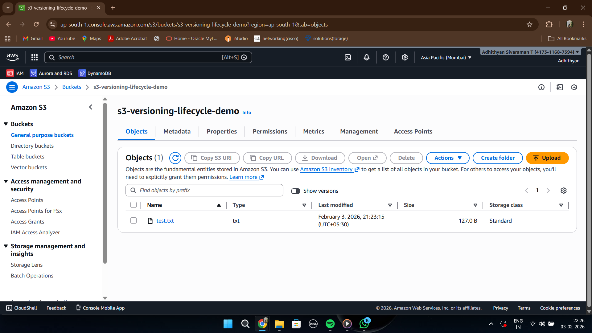
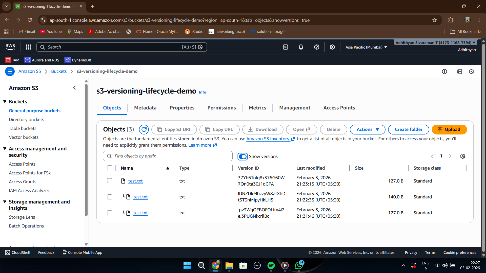
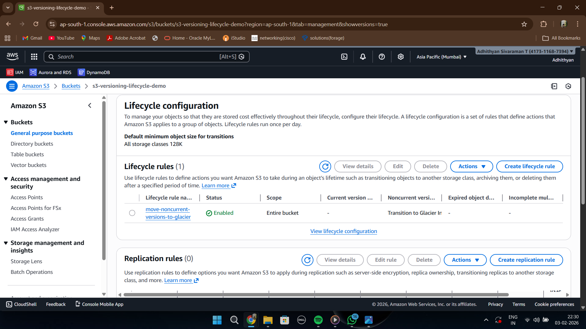
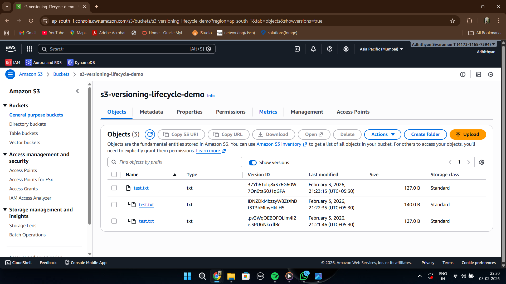

# Screenshots Folder

This folder contains implementation screenshots captured during the development of the S3 Versioning and Lifecycle Management project.

These screenshots document the practical workflow followed while configuring:

* Amazon S3 buckets
* bucket versioning
* object version management
* lifecycle rules
* Glacier transitions

---

# Included Screenshots

## 01-bucket-list.png

This screenshot shows the list of Amazon S3 buckets created during the implementation process.

### Key Details

* S3 bucket successfully created
* Bucket configured for storage lifecycle management
* Foundation for versioning and archival workflow established

### Concepts Learned

* Amazon S3 bucket management
* Cloud object storage fundamentals
* Storage architecture setup

---

## 02-versioning-enabled.png

This screenshot shows versioning enabled for the S3 bucket.

### Key Details

* Bucket versioning successfully activated
* Multiple object versions can now be preserved
* Data protection workflow enabled

### Concepts Learned

* S3 object versioning
* Protection against accidental deletion
* Object recovery concepts
* Backup-oriented storage design

---

## 03-object-uploaded.png

This screenshot shows an object uploaded into the S3 bucket.

### Key Details

* Object successfully uploaded into Amazon S3
* Storage workflow validated
* Base object version created

### Concepts Learned

* S3 object management
* Cloud storage upload workflow
* Object-based storage concepts

---

## 04-object-versions.png

This screenshot shows multiple versions of the same object stored inside the version-enabled S3 bucket.

### Key Details

* Multiple object versions preserved successfully
* Older versions marked as noncurrent
* Version tracking validated

### Concepts Learned

* Noncurrent object versions
* Object history preservation
* Version recovery concepts
* Storage reliability workflow

---

## 05-lifecycle-rule.png

This screenshot shows the lifecycle rule configured for transitioning noncurrent object versions to Glacier.

### Key Details

* Lifecycle policy successfully configured
* Automated archival workflow enabled
* Transition rules defined for older versions

### Concepts Learned

* Lifecycle automation
* Storage lifecycle management
* Automated archival workflow
* Cloud storage optimization

---

## 06-storage-class.png

This screenshot shows noncurrent object versions transitioned into Glacier storage class.

### Key Details

* Noncurrent versions archived successfully
* Glacier storage transition validated
* Cost optimization workflow confirmed

### Concepts Learned

* Glacier archival storage
* Storage class transitions
* Cost optimization strategies
* Long-term backup storage concepts

---

# Purpose of These Screenshots

These screenshots provide:

* visual proof of implementation
* lifecycle workflow validation
* versioning demonstration
* Glacier archival workflow confirmation
* practical understanding of AWS storage management

The screenshots help demonstrate how modern cloud storage architectures manage:

* backup protection
* automated archival
* storage lifecycle automation
* cost optimization workflows
